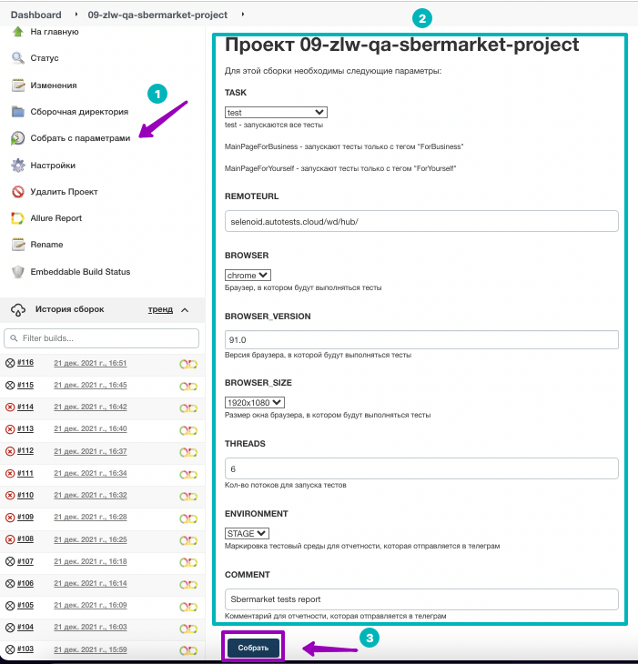
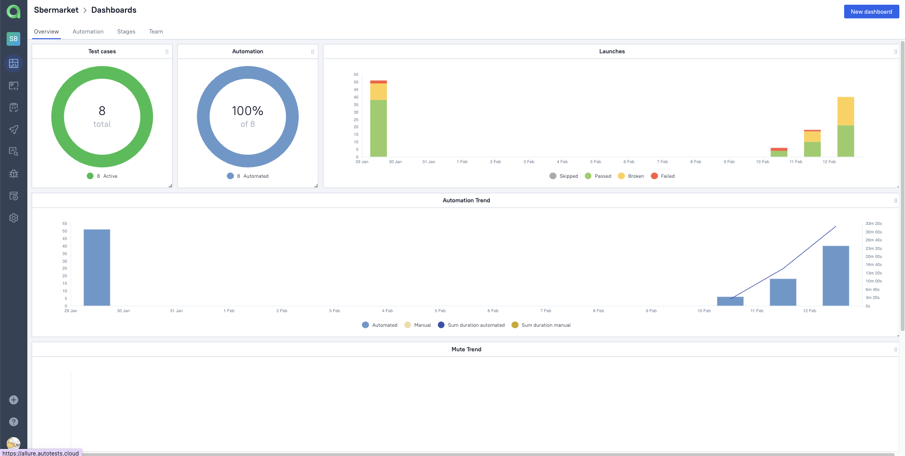
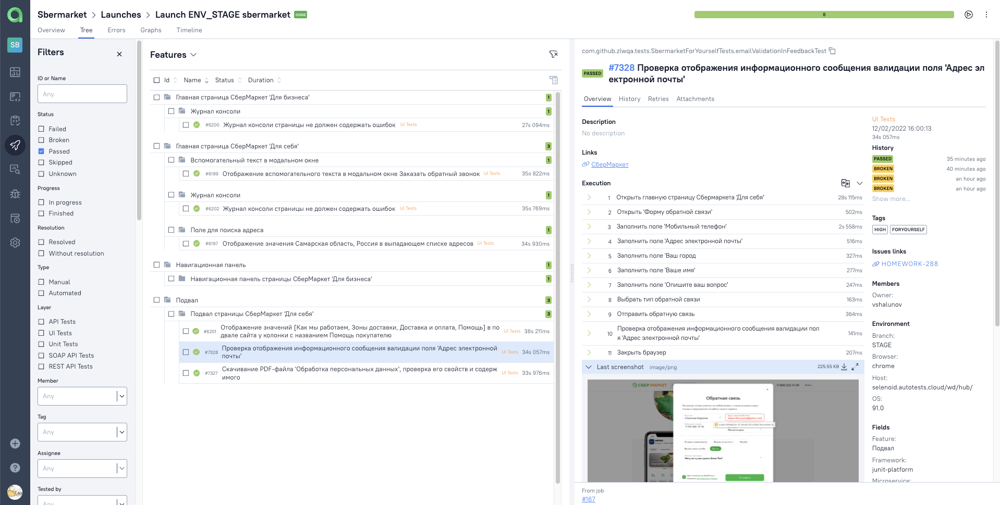
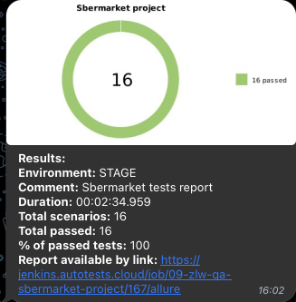
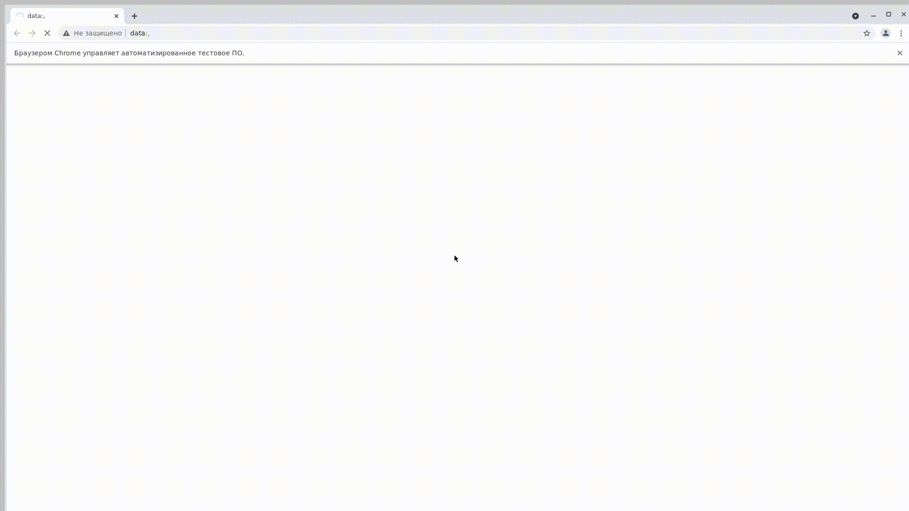

# Проект по автоматизации тестирования для [Сбермаркет](https://sbermarket.ru/)

<p align="center">

</p>

##  Покрытый функционал

### UI

- :white_check_mark: Отображение значения в выпадающем списке адресов на странице "Для себя"
- :white_check_mark: Отображение значений в подвале сайта на странице "Для себя"
- :white_check_mark: Отображение вспомогательного текста в модальных окнах на странице "Для бизнеса"
- :white_check_mark: Отображение пунктов навигационной панели на странице "Для себя"
- :white_check_mark: Отсутствие ошибок в журнале консоли страниц "Для себя" и "Для бизнеса"

##  Технологический стек

<p align="center">


</p>

> В данном проекте автотесты написаны на <code>Java</code> с использованием фреймворка <code>Selenide</code>
>
> <code>JUnit 5</code> используется для модульного тестирования
>
> <code>Gradle</code> используется для автоматизированной сборки проекта
>
> <code>Jenkins</code> выполняет запуск тестов
>
> <code>Selenoid</code> выполняет запуск браузеров в контейнерах <code>Docker</code>
>
> <code>Allure Report</code> формирует отчет о запуске тестов
>
> Автотесты интегрируются с тест-менеджмент системой <code>Allure TestOps</code> и таск-трекер системой <code>Jira</code>
>
> В <code>Telegram</code> отправляются уведомления о пройденном прогоне

##  Запуск тестов из терминала

### :rocket: Локальный запуск тестов

```
gradle clean ${task}
```

### :rocket: Удаленный запуск тестов с заполненным файлом credentials.properties

> <details>
> <summary>:exclamation:</summary>
>
> + В файле <code>credentials.properties</code> должен находиться _логин_ и _пароль_ от удаленного selenoid, на котором будут запускаться тесты
> </details>

```
gradle clean ${task}
-DremoteURL=${REMOTEURL}
-Dbrowser=${BROWSER}
-DversionBrowser=${BROWSER_VERSION}
-DbrowserSize=${BROWSER_SIZE}
-Dthreads=${THREADS}
```

### :rocket: Параметры сборки

> <details>
> <summary><code>task</code> - список тестов, сгруппированных по параметру тега. В зависимости от выбранного параметра будут запускаться определенные группы тестов</summary>
>
> + test - запуск всех тестов
> + MainPageForBusiness - запускают тесты только с тегом "ForBusiness" (Страница "Для бизнеса")
> + MainPageForYourself - запускают тесты только с тегом "ForYourself" (Страница "Для себя")
> </details>
>
> <code>REMOTEURL</code> - адрес удаленного сервера, на котором будут запускаться тесты
>
> <code>BROWSER</code> - браузер, на котором буду запускаться тесты (_по умолчанию - <code>chrome</code>_)
>
> <code>BROWSER_VERSION</code> - версия сервера, на которой будут запускаться тесты (_по умолчанию - <code>91.0</code>_)
>
> <code>BROWSER_SIZE</code> - размер браузера, на котором будут запускаться тесты (_по умолчанию - <code>1920x1080</code>_)
>
> <code>THREADS</code> - количество потоков для запуска тестов

###  Формирование отчета Allure

> <details>
> <summary>:exclamation:</summary>
>
> + Предварительно необходимо установить _Allure_
> </details>

```
allure serve build/allure-results
```

##  Запуск тестов в [Jenkins](https://jenkins.autotests.cloud/job/09-zlw-qa-sbermarket-project/)

### :triangular_flag_on_post:     Для запуска тестов в Jenkins необходимо выполнить следующие шаги:

1. Открыть сборку [Jenkins](https://jenkins.autotests.cloud/job/09-zlw-qa-sbermarket-project)
2. Нажать на таск <code>"Собрать с параметрами"</code>
3. Указать [значения параметров](#rocket-параметры-сборки)
4. Нажать на кнопку <code>"Собрать"</code>

<p align="center">

</p>

### :triangular_flag_on_post: Для формирования отчета о прохождении тестов в Allure Report необходимо выполнить следующий шаг:

5. После выполнения сборки нажать на любую ссылку/иконку <code>"Allure Report"</code>

<p>

</p>

##  Отчет о результатах тестирования в [Allure Report](https://jenkins.autotests.cloud/job/09-zlw-qa-sbermarket-project/allure/)

> <code>Allure-framework</code> используется в качестве инструмента для построения отчетов о прогоне автотестов.
> Он позволяет получить информацию о ходе выполнения тестов, а также прикрепить скриншоты, логи и видео к формируемому отчету.
> Имеется возможность указать различные теги, приоритеты и прочую сопутствующую информацию для тестов.
>

### :dart: Главная страница Allure-отчета

<p align="center">

</p>

### :dart: Информация о тестовом прогоне в графическом виде

<p align="center">

</p>

### :dart: Группировка тестов по проверяемому функционалу

<p align="center">

</p>

##  Интеграция тестов c тест-менеджмент системой [Allure TestOps](https://allure.autotests.cloud/project/778/dashboards)

> <code>Allure TestOps</code> это платформа управления качеством программного обеспечения, объединяющая автоматическое и ручное тестирование, которая позволяет управлять всем, что связано с тестированием, в одном месте.

### :test_tube:     Основной дашборд

<p align="center">

</p>

### :test_tube:     Запуски тестов

<p align="center">

</p>

### :test_tube:     Результаты запуска тестов

<p align="center">

</p>

### :test_tube: Сгруппированные тест-кейсы по проверяемому функционалу

<p align="center">

</p>

##  Интеграция тестов c таск-трекер системой [Jira](https://jira.autotests.cloud/browse/HOMEWORK-288)

> Интеграция с <code>Jira</code> позволяет добавлять в задачи тест-кейсы, запуски и их результаты.

<p align="center">

</p>

##  Уведомления в Telegram с использованием бота

> Реализована отправка уведомлений о прогоне с помощью бота в <code>Telegram</code>.
> Фреймворк также поддерживает уведомления по _электронной почте, Slack, Skype_ и _Mattermost_.

<p align="center">

</p>

##  Пример запуска теста в Selenoid

> Для каждого теста записывается и прилагается видео прогона.

<p align="center">
  
</p>

<details>
<summary></summary>

##  Пример запуска теста в Selenoid

> Для каждого теста записывается и прилагается видео прогона.

<p align="center">
  
</p>

</details>


